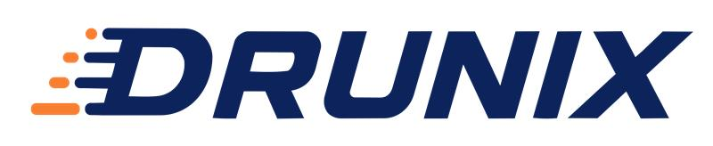

## Drunix : Performant, enterprise-grade blockchain platform

[)]()

Drunix is an open-source, enterprise-grade blockchain platform designed to help organisations build and scale tokenization platforms, digital asset ecosystems and multi-organisation networks. Drunix is a high-performance distributed ledger platform built as an enhanced fork of Hyperledger Fabric.

## Features
- [x] Segregated responsibility for peers
- [x] SQL database support for on-chain storage
- [x] Reduced network calls for private data sharing
- [x] Stateless transaction validation service
- [x] Backwards compatible with HLF v2.5.x

More details can be found in [architecture changes](docs/drunix-arch.md)

## Samples

Refer to our sample [test network](drunix-network/test-network/README.md) for running Drunix blockchain network in your local machine

## Disclaimer

This program is free software: you can redistribute it and/or modify it under the terms of Apache License, Version 2.0(Apache-2.0).
This program is distributed in the hope that it will be useful, but WITHOUT ANY WARRANTY; without even the implied warranty of MERCHANTABILITY or FITNESS FOR A PARTICULAR PURPOSE. See Apache License, Version 2.0(Apache-2.0) for more details. 

## Acknowledgments and Credits

This project is a fork of the original [Hyperledger Fabric](https://github.com/hyperledger/fabric) developed by [LF Decentralized Trust](https://www.lfdecentralizedtrust.org/projects/fabric).

We are incredibly grateful for their hard work. This fork builds upon their codebase to add support for features like SQL store as on-chain storage, stateless validation service, separation of endorsement and committing peers.

The original code is licensed under the **Apache License, Version 2.0(Apache-2.0)** (see the accompanying LICENSE file for details).

## License

Drunix source code files are made available under Apache License, Version 2.0(Apache-2.0), located in the LICENSE file

