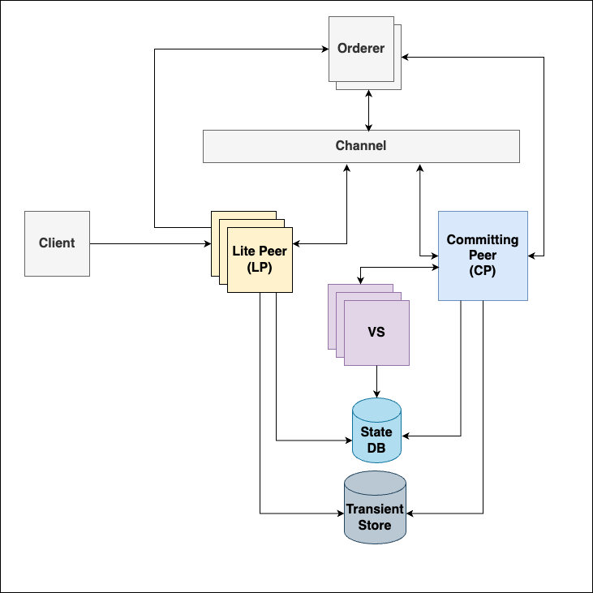
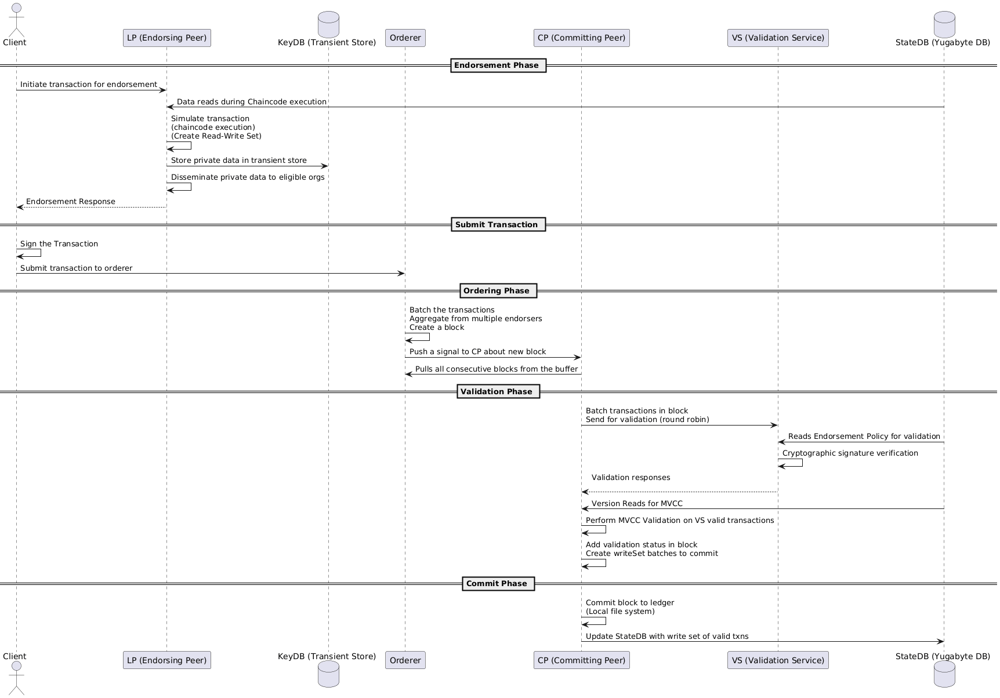

## Drunix - Architecture Changes Overview

## Features
### Segregated Responsibility for Peers 
Current peer is split into two separate peers - for endorsements (Lite Peer) and Validations (Committing Peer) so that they can be scaled independently.
### SQL Database Support
Drunix extended the support to SQL databases (YugabyteDB) in adition to No-SOL(couchDB & LevelDB).
### Reduced network calls for private data sharing  
Shared state DB & Transient Store (KeyDB) within an org, Batch Reads and Writes in both Lite Peer and Committing Peers to optimize network calls 
### Stateless Validation Service  
DLT specific transaction validations can now be done by a bunch of stateless validation service which can be scaled up or down depending on current load on the system  

---

## Architecture

## Segregated Responsibility for Peers 
The peer is split into two separate peers. 

### LP (Lite Peer): 
The Lite Peer represents a specialized peer role focused exclusively on transaction endorsement activities. It operates with a streamlined architecture that eliminates the need for local ledger storage, thereby enabling horizontal scaling to accommodate increased workloads efficiently. This peer type is optimized for endorsement processing and handles the initial phases of transaction validation. 

### CP (Committing Peer):  
The Committing Peer assumes responsibility for the validation and commitment of transactions to the ledger. This peer type performs critical functions including sanity checks on incoming blocks, coordination with the Validation Service for transaction validation, and the execution of Multi-Version Concurrency Control (MVCC) validation to ensure data consistency. The CP is responsible for committing transactions to both the blockchain and the state database. 

---

## Design Considerations 
### Separation of Concerns 
The peer segregation approach implements a clear separation of transaction processing responsibilities. The Lite Peer focuses on endorsement and transaction simulation, while the Committing Peer manages validation and ledger commitment. This architectural division reduces complexity and improves maintainability. 

### Scalability Enhancement 
By separating the endorsement and validation functions, the system achieves improved scalability. Lite Peers can be scaled independently of the validation infrastructure, allowing organizations to optimize resources based on their specific workload requirements. 

### Performance Optimization 
The segregation reduces computational overhead by eliminating redundant operations. The Lite Peer's stateless nature and the Committing Peer's optimized validation processes contribute to enhanced overall system performance. 

### Data Consistency 
The architectural design ensures data consistency through proper coordination between the two peer types, particularly through the MVCC validation mechanism employed by the Committing Peer. 

---

## Technical Implementation 

### Lite Peer Responsibilities 

#### Transaction Endorsement 
The Lite Peer executes chaincode and completes endorsement processes for transactions. This includes simulating transaction execution and generating endorsement responses that are subsequently transmitted to the client. 

#### Private Data Management 
The Lite Peer handles storage of private data within a transient store (KeyDB) and disseminates this information to other eligible peers across organizations. This mechanism ensures that private data is efficiently managed without requiring local ledger storage. 

#### Stateless Operation 
The Lite Peer operates in a stateless manner, ensuring that no ledger data is stored locally. This characteristic enables the peer to be horizontally scaled to handle increased workloads efficiently without the overhead of maintaining local state. 

#### Commit Status Handling 
The Lite Peer manages CommitStatus calls by delegating requests to the Committing Peer, capturing the responses, and relaying them back to the client. This delegation maintains the separation of concerns while ensuring complete transaction lifecycle management. 

### Committing Peer Responsibilities 

#### Block Validation 
The Committing Peer performs comprehensive sanity validations on incoming blocks to ensure their integrity and compliance with network policies before processing. 

#### Validation Service Coordination 
The Committing Peer coordinates with the Validation Service (VS) by creating transaction batches for validation, distributing among the validation servers and also collecting back the responses. This coordination ensures that transactions undergo proper validation before commitment. 

#### Private Data Retrieval 
The Committing Peer handles private data retrieval either from the transient store (first Priority) or from levelDB or by requesting data from other eligible peers. This mechanism ensures that all required private data is available for transaction processing. 

#### MVCC Validation 
The Committing Peer executes Multi-Version Concurrency Control (MVCC) validation to ensure data consistency and prevent conflicts during concurrent transaction processing. This validation mechanism maintains the integrity of the ledger state. 

#### Ledger Commitment 
The Committing Peer commits transactions to the ledger, updating both the blockchain and the state database. This final step ensures that validated transactions are permanently recorded in the distributed ledger. 

---

## SQL Database Support
Hyperledger Fabric primarily supports NoSQL-based state databases, specifically:
  **LevelDB** (default embedded key-value store)
  **CouchDB** (external JSON-based NoSQL database with rich query support)

In contrast, Drunix extends this capability by introducing support for SQL-based databases, enabling compatibility with distributed relational systems such as:

**YugabyteDB**

This enhancement allows Drunix to leverage the advantages of relational database systems—such as structured querying (SQL), strong consistency models, and advanced analytics—while maintaining compatibility with blockchain-based storage mechanisms

---

## Reduced network calls for private data sharing 
### Latency Optimization in Drunix Architecture 
In Hyperledger Fabric, one of the major contributors to transaction latency is the **private data synchronization** among peers and across organizations. This involves: 

- **Endorsing peers (LP)** distributing private data during endorsement

- **Committing peers (CP)** fetching private data during the commit phase

#### Drunix Architectural Enhancement 
To address this challenge, Drunix introduces KeyDB as a transient store within its architecture. Both LP (Lite Peer) and CP (Committing Peer) are connected to a common KeyDB, which serves as a shared transient storage layer

This design eliminates: 
- The need for private data distribution by LP during endorsement
- The need for private data fetch by CP during commit

As a result, the system significantly reduces transaction latency by removing the overhead of private data synchronization across peers and organizations

---

## Stateless Validation Service 
### Validation Service (VS) Architecture 
The Validation Service (VS) is a stateless component designed to enable horizontal scalability, ensuring efficient transaction validation across the network. Its primary responsibility is to perform policy acceptance checks on the endorsements

### Drunix Enhancement
In the earlier design, the vanilla peer executed the Validation System Chaincode (VSCC) internally as part of its processing workflow. 

This functionality has now been decoupled and implemented as a dedicated service. By separating validation from the peer: 

- Transactions can be distributed across multiple VS servers
- Validation tasks can be processed in parallel, reducing overall latency
- Peers are offloaded from validation responsibilities, improving their efficiency

### Benefits
- **Improved Performance**: Reduced processing overhead on peers
- **Higher Throughput**: Parallel validation accelerates transaction flow 
- **Scalability**: Flexible horizontal scaling by adding more VS instances

---

## Transaction Flow
The transaction flow consists of the following phases:
1. Endorsement Phase  
2. Transaction Submission  
3. Ordering Phase  
4. Validation Phase  
5. Commit Phase  

---

## 1. Endorsement Phase

### Flow:
- Client initiates a transaction proposal to the Endorsing Peer (LP)
- The Endorsing Peer:
  - Executes chaincode (simulation only)
  - Reads ledger state data.
  - Generates a Read-Write Set (RW Set)
- Private data handling:
  - Stored in KeyDB (Transient Store)
  - Shared with eligible organizations
- Endorsing Peer sends a signed endorsement response back to the client

---

## 2. Submit Transaction

### Flow:
- Client collects endorsement responses
- Signs the transaction
- Submits the transaction to the Orderer

---

## 3. Ordering Phase

### Flow:
- Orderer:
  - Receives transactions from clients
  - Batches transactions from multiple sources
  - Creates blocks
- Block distribution:
  - Orderer notifies Committing Peers (CP)
  - CP pulls consecutive blocks from the buffer

---

## 4. Validation Phase

### Flow:
- Committing Peer processes transactions in the block
- Transactions are sent to Validation Service (VS) in round-robin fashion

### Validation Steps:
- VS:
  - Reads endorsement policy
  - Performs cryptographic signature verification
- VS sends validation responses back to CP

### MVCC Validation:
- CP:
  - Fetches version reads from StateDB
  - Performs MVCC (Multi-Version Concurrency Control) validation
  - Detects read-write conflicts

### Finalization:
- Mark transactions as valid or invalid
- Prepare write sets for valid transactions
- Append validation results to the block

---

## 5. Commit Phase

### Flow:
- Committing Peer:
  - Commits the block to the ledger (local file system)
  - Applies write sets of valid transactions to StateDB

---

## Key Concepts

### Read-Write Set (RW Set)
Represents:
- Keys read during simulation
- Keys updated during execution

### Transient Store (KeyDB)
- Temporary storage for private data
- Not persisted to the ledger

### Endorsement Policy
- Defines required endorsers for a transaction to be valid

### MVCC Validation
- Ensures consistency
- Prevents conflicts from concurrent transactions

---

## Sequence Diagram

---

